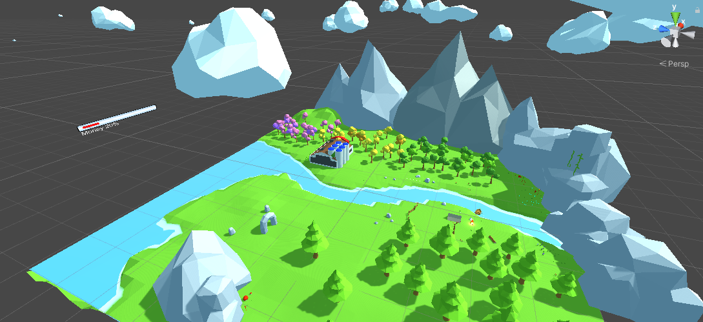

<h1 align="center">
    Hello World
</h1>


<h6 align="center">
A VR Game developed for HCI902a Class to showcase the evolution and effects of climate change
<br />
<a href="https://youtu.be/DTjiZaqXFIg">View Demo(final)</a>
·
<a href="https://youtu.be/fIYr8tuW-qU">View Demo(first)</a>
·
<a href="">Report Bug</a>

</h6>
<div align="center">

</div>

---

<br />

## Gallery
<div align="center">

</div>


## How to install
1. Download the APK file from the release section of the repo. 
2. Install the app on your Android VR device and Run.

**Note**: A device supporting at least Android 8.0 Oreo (API level 26) is required to be able to run this game.
<br/>
**Disclaimer**: This app was developed with the `Pico S` and its controller in mind. Some interactions may not be the same on other platforms. 

## How to play
Once you load into the world, appreciate its beauty and the global illumination first. Then you can point your `Raycaster` on any position on the terrain and click the `Trigger` to teleport there. You can also use the `dpad` or the `touch surface` to walk in the specified direction. <br/>


You can point at any tree in the world and then press the `Trigger` to cut it down and replace it with a factory or a house. Click repeatedly to choose the structure you prefer. 


Your actions have consequences. Cutting trees and placing factories will result in the `environment health` to drop and `money` to increase as displayed by the 2 dynamically updated `UI bars`. You will soon notice that also the `water level` continuously  rises to flood the world. 


Use the `volume up` or `volume down` button to adjust the music and sound effects' volume level to your liking.


## How to edit

**Note**: Unity LTS version 2020.3.34f1 is required to be able to edit this game. 

1. Clone the repository 
```bash
$ git clone https://github.com/pyuan-21/HCI902a-Project.git
```
2. Import the project into your Unity Hub/Editor


## Credits

| Family Name  |  Name | Institution  |
|---|---|---|
| Chana  |  Salma | Institut Polytechnique de Paris  | 
| Mahmoud |  Houssem  |  Université Paris-Saclay |
| Yuan  | Putian  |  Institut Polytechnique de Paris |

## Ressources link:

The naturel scene: https://assetstore.unity.com/packages/3d/environments/landscapes/simple-low-poly-nature-pack-157552

Building: https://assetstore.unity.com/packages/3d/environments/urban/lowpoly-modern-city-buildings-set-64427

UI slider: https://assetstore.unity.com/packages/tools/gui/progressbar-pack-120981
